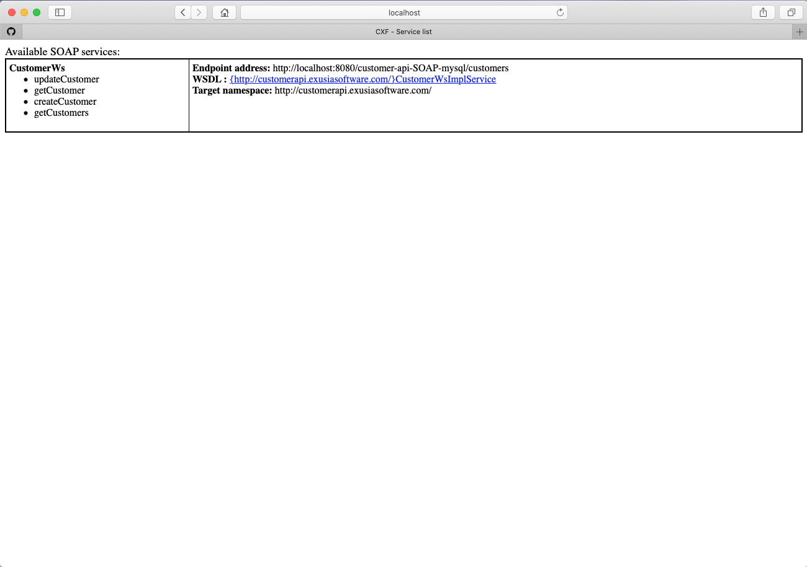
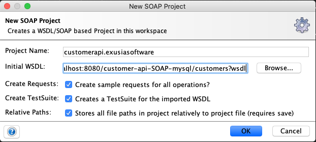
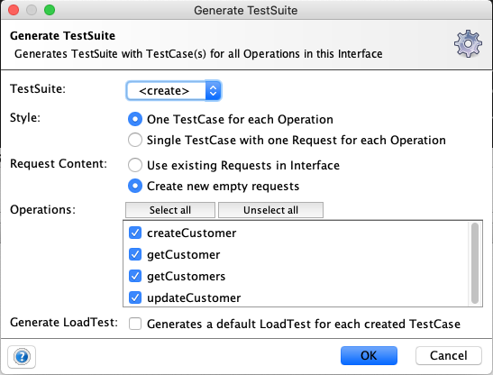
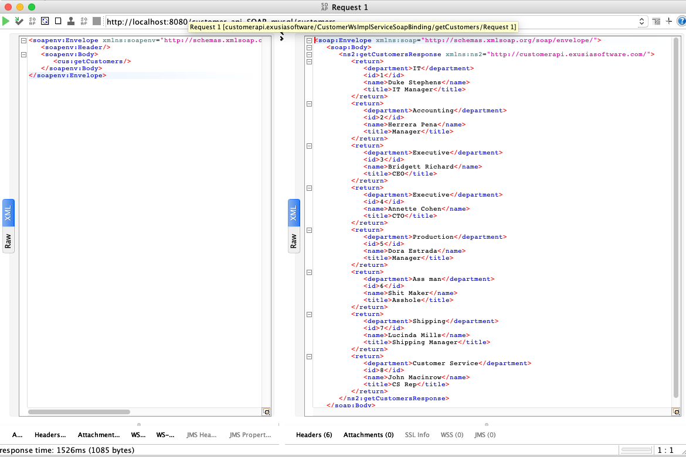
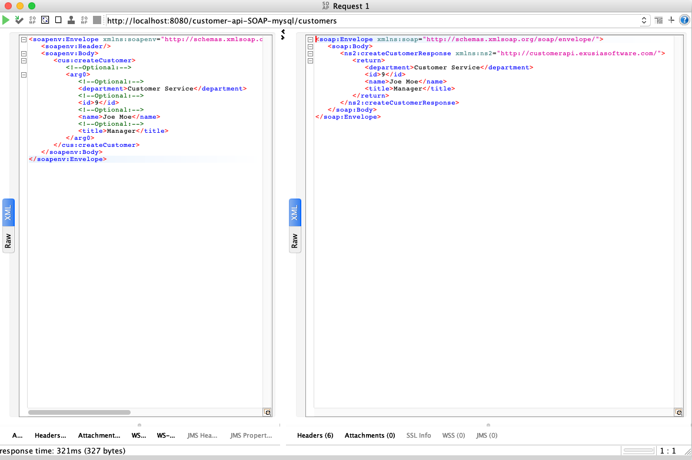
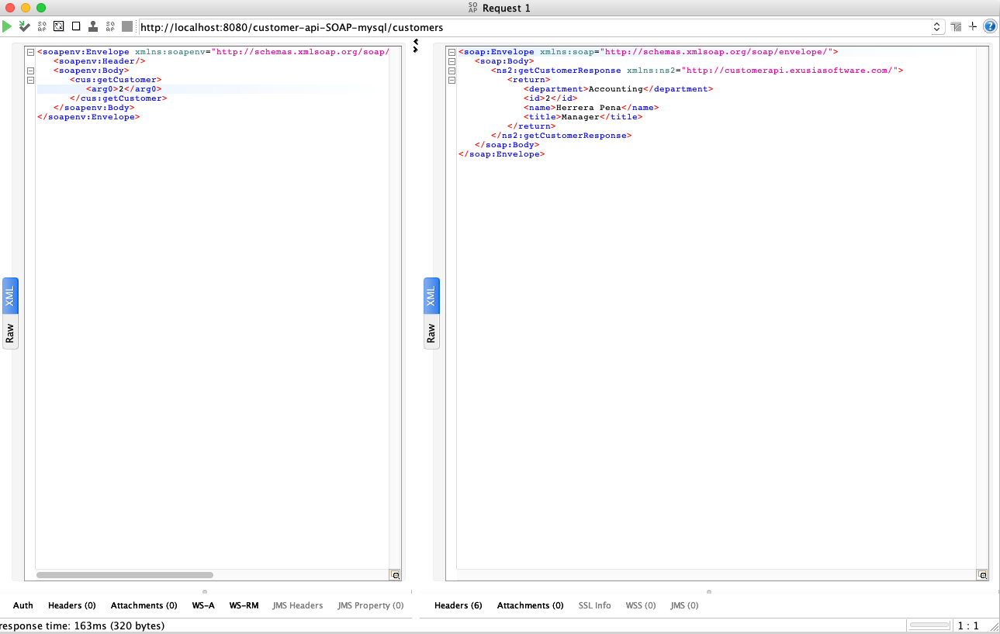
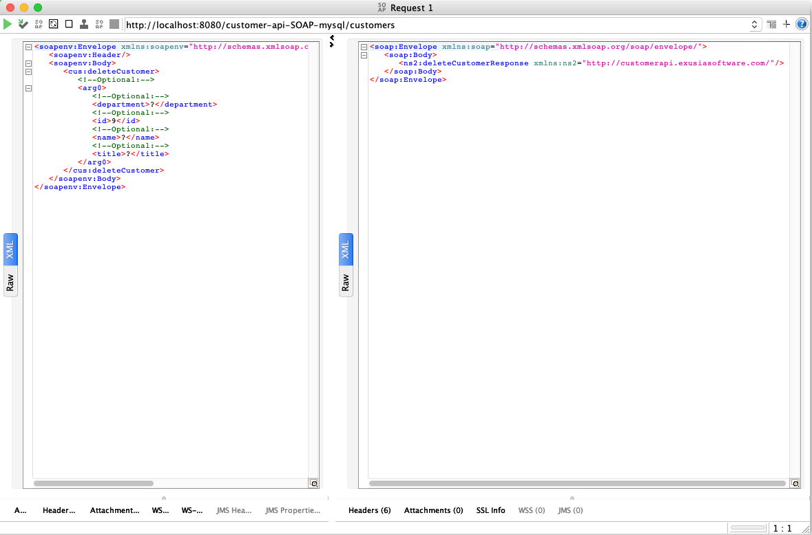

# Customer SOAP API with MYSQL
Spring SOAP API Framework
use to test Docker and Kubernetes Microservices 

Example solution:

http://localhost:8080/customer-api-SOAP-mysql or http://localhost/customer-api-SOAP-mysql


 


````
                    ----------------------------
                    Load balancer port 80:8080 
                    ----------------------------
                       |                   |
    --------------------------      --------------------------
      Customer-API Port 8080          Customer-API Port 8080 
    --------------------------      --------------------------  
                      |              |
                    --------------------  
                           MYSQL DB
                    --------------------       

````

Create a Docker image for MYSQL:

````
docker build -t mysqlserver:1 -f Dockerfile_MYSQL .
````

Launch a MYSQL deployment:

``````
docker run -d -p 3306:3306 --name mysqltest mysqlserver:1
``````

Seed the database:

``````
docker exec -i mysqltest sh -c 'exec mysql -uroot -p"$MYSQL_ROOT_PASSWORD"' < customer.sql
``````

Compile code run:

````
docker inspect mysqltest | grep IPAddress
export MYSQL_DB_HOST=IPAddress
mvn clean install
(Be sure MYSQL is running)

````

Run the application on workstation:

````
java -jar target/customer-api-SOAP-mysql-1.0.0.jar

````

Create a Docker image:

````
docker build -t customer-api-soap-mysql:xxx .
````
Create a docker container from image: 

````
docker run -d -p 8080:8080 --name customer-api-soap-mysql customer-api-soap-mysql:xxx
````


Create a Kubernetes Deployment:

````
kubectl create -f customer-api-deployment.yml 
````
Create a Kubernetes Service:

````
kubectl create -f loadblancer-customer-api.yml
````


## Usage: 
````
Use SOAPUI
New SOAP Project:

1) Create a project name
For the Initial WSDL:
2) http://localhost:8080/customer-api-SOAP-mysql/customers?wsdl
3) Check all options

   
`````



````

Get all Customers:

````


````

Get Customer by id:

````


````
Add a Customer 

````



````
Update a Customer by id

````


````
Delete a Customer by id

````



